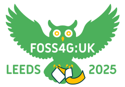

<h3 style="margin-bottom:0; padding-bottom:0;">Dennis Bauszus</h3>
<em>Co-chair | Geolytix</em>

[Dennis on LinkedIn](https://www.linkedin.com/in/dennis-bauszus-45b55760/ "LinkedIn"){:target="_blank"}

 

<h3 style="margin-bottom:0; padding-bottom:0;">Json Singh</h3>
<em>Co-chair, website | Freelance</em>

[Json on jsonsingh.com](https://jsonsingh.com){:target="_blank"}

 

<h3 style="margin-bottom:0; padding-bottom:0;">Matt Travis</h3>
<em>Treasurer, Sponsorship | Addresscloud</em>

[Matt on LinkedIn](https://www.linkedin.com/in/matt-travis-6a609321/ "LinkedIn"){:target="_blank"}

 
<h3 style="margin-bottom:0; padding-bottom:0;">Nick Bearman</h3>
<em>Website, Social Media | Freelance</em>

[Nick on LinkedIn](https://www.linkedin.com/in/nickbearman "LinkedIn"){:target="_blank"}

 
<h3 style="margin-bottom:0; padding-bottom:0;">Ant Scott</h3>
<em>Website, Ticketing | Freelance</em>

[Ant on Mastodon](https://mastodon.social/@antscott "Mastodon"){:target="_blank"}

 
<h3 style="margin-bottom:0; padding-bottom:0;">Claire Birnie</h3>
<em>Social Event | Maptastic</em>

[Claire on LinkedIn](https://www.linkedin.com/in/clairelouisebirnie/?originalSubdomain=uk "LinkedIn"){:target="_blank"}

 

<h3 style="margin-bottom:0; padding-bottom:0;">Jonny Huck</h3>
<em>Website | Manchester University</em>

[Jonny on jonnyhuck.co.uk](http://jonnyhuck.co.uk/){:target="_blank"}

 

<h3 style="margin-bottom:0; padding-bottom:0;">Weiming Huang</h3>
<em>Programme | University of Leeds</em>

[Weiming at Leeds](https://environment.leeds.ac.uk/geography/staff/13092/dr-weiming-huang){:target="_blank"}

 
