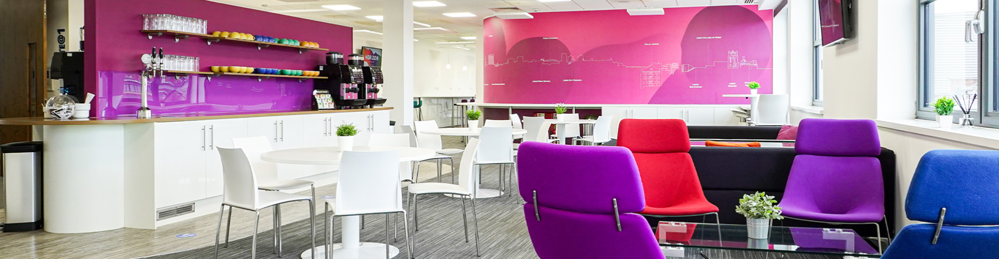

FOSS4G:UK 2025 in Leeds is fast approaching - it's on the _1st and 2nd of October_ 2025, and tickets are limited, so get yours now! We will be meeting in the state of the art [Horizon](https://horizonleeds.co.uk/) venue in the heart of Leeds.

Here are all the details:

* The programme is out! There are 53 talks and workshops across two days and four rooms, [check it out here](https://uk.osgeo.org/foss4guk2025/programme/) 
* Early Bird tickets are now all gone, but standard tickets at £110 are great value too - [register here now](https://www.eventbrite.co.uk/e/1335076522819?aff=oddtdtcreator). There's also a social event at £20, and £15 for a unique conference t-shirt

## Social event at Canal Club

We are organising a social event at the [Canal Club](https://www.canalclub.co.uk/) in the evening on October 1st. The club is next to Leeds Station which is about 10 minutes walk from Horizon Leeds. There will be a welcome drink and buffet at this networking event. Tickets for this event are £20 and can be selected as an optional extra through the Eventbrite registration for FOSS4G:UK 2025.

In the meantime, save the date, and get the latest news on [LinkedIn](https://www.linkedin.com/company/osgeo-uk/), [Mastodon](https://fosstodon.org/@osgeouk), [Bluesky](https://bsky.app/profile/uk.osgeo.org), [join the mailing list](https://lists.osgeo.org/mailman/listinfo/uk), [subscribe to the newsletter](https://stats.sender.net/forms/b4160d/view), and [contact us by email](mailto:osgeouk@gmail.com).
