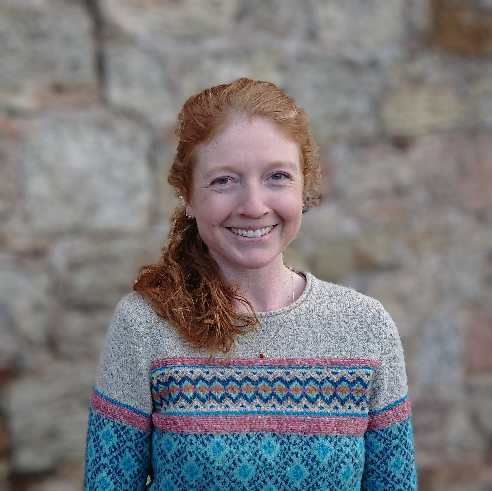
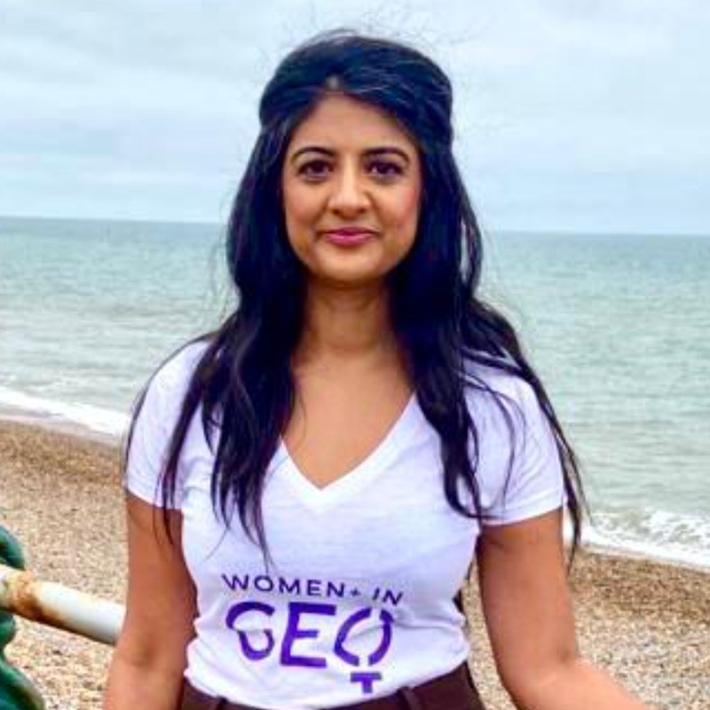
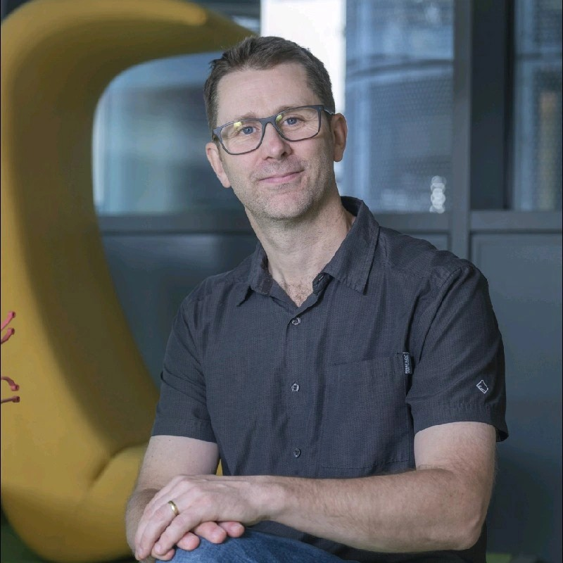

    
    

        <h3 style="margin-bottom:0; padding-bottom:0;">Kathryn Berger</h3>
        <em>Lead Data Scientist at DSIT</em>
        <a href="https://www.linkedin.com/in/kathryn-berger-3a71941b/" target="_blank">

</a>
    

Kathryn Berger is a Lead Data Scientist within the UK government's Department for Science, Innovation, and Technology (DSIT). She joined the civil service earlier this year, after spending over 15 years working across academia and the private sector, building and leading projects that use geospatial models to better understand disease risk and turn complex data into something people can actually use. She is passionate about harnessing geospatial data to solve the challenges of global health and food security. Kathryn believes in making machine learning tools, data, and resources more accessible for social good through open data and open science.

 

    
    

        <h3 style="margin-bottom:0; padding-bottom:0;">Mariam Crichton</h3>
        <em>INSPIRE Lead (Women+ in Geospatial) and CEO (7 Satya)</em>
        <a href="https://www.linkedin.com/in/mariamcrichton/" target="_blank">

</a>
    

With a dynamic entrepreneurial spirit spanning 17 years, Mariam has been the driving force behind the growth of numerous tech startups. Mariam’s roles as CEO, Board Member, and Strategist have consistently led to the transformation of innovative technology companies from startup to scaleup.

As a purpose-driven leader, her career has been dedicated to delivering global technology solutions that make a positive Environmental and Social Impact, particularly in the realms of Geospatial and International Development. At 7 Satya, she brings invaluable locational insights, emphasising Environmental and Socioeconomic (ESG) factors, to businesses worldwide.

At Women+ in Geospatial she leads the Newsletter, Events and External Communications team and sits on the board.

 

    
    

        <h3 style="margin-bottom:0; padding-bottom:0;">Alasdair Rae</h3>
        <em>Head of Data and Spatial Analysis at Lanpro</em>
        <a href="https://www.linkedin.com/in/alasdair-rae-17640a124/" target="_blank">

</a>
    

Alasdair leads the GIS and spatial analysis team at Lanpro and has worked in geographic data analysis for more than 20 years. Before joining Lanpro he founded Automatic Knowledge – a spatial data, analysis and training company. Prior to this he worked in academia as a Professor in Urban Studies and Planning at the University of Sheffield. He has worked with clients of all sizes, from Google and the BBC, to national, regional and local governments – as well as small non-profits and charities.

He has long been an advocate for open data in the GIS world and has co-authored three books and more than 20 academic papers on topics such as spatial planning, housing, deprivation, urban policy and transport. Alasdair has a PhD in urban and regional analysis, and his work has featured regularly in the national and international press.

