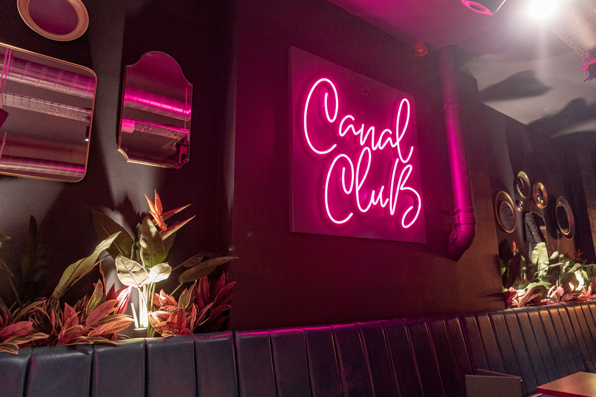
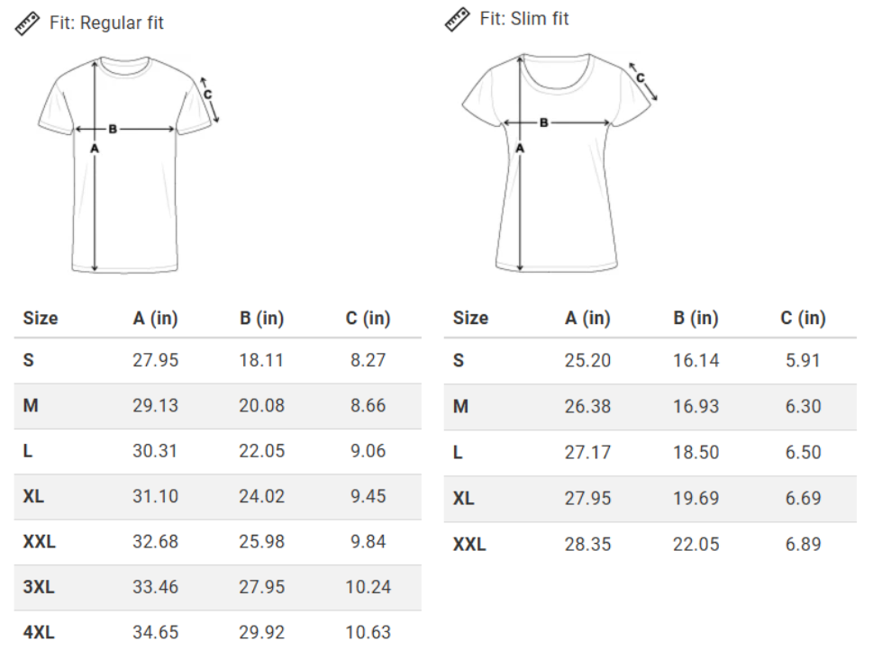

[Registration for the two days of FOSS4G:UK 2025 in October is open!](https://www.eventbrite.co.uk/e/1335076522819?aff=oddtdtcreator). Full price tickets are <b>£110</b>, to cover a full programme of over 40 talks and workshops over the two days. 

There'll be a optional social event at the [Canal Club](https://www.canalclub.co.uk/) on the evening of 1st October for an addional cost of £20 (to cover venue costs and food), which is an add-on in the registration form. This will be a great chance to socialise with other delegates and catch up on the day's events, so please sign up to enjoy an evening of networking around FOSS4G and anything else!

We want FOSS4G:UK 2025 to be as accessible as possible, so we have a number of codes available for two-day tickets discounted to £20. These are available for students, under represented groups, those on a low income, those in precarious employment, and anyone else for whom a full price ticket would be a barrier (financial or administrative). All of these criteria are self-defined. We very much encourage you to email osgeouk@gmail.com to ask for a code, stating which group you belong to (no further justification is needed).

Conference t-shirts are an optional extra which can also be selected through the registration form for £15. We will be using [spreadshirt](https://www.spreadshirt.co.uk/) to print t-shirts prior to the conference in October. You are more than welcome to print your own shirt using the SVG logo below. We are offering the service to print shirts in order to save on delivery and printing costs. Please see these size guides for the men's and women's t-shirt.

