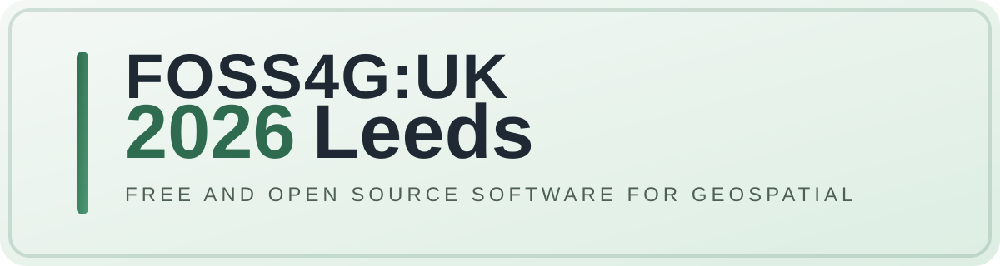

  <strong>🎤 Call for Talks and Registration now OPEN!</strong> Submit your presentation or workshop proposal at <a href="https://talks.osgeo.org/foss4g-uk-2026/cfp">talks.osgeo.org</a>, and register now <a hef="https://uk.osgeo.org/foss4guk2026/registration/">here</a>.

FOSS4G:UK 2026 returns to Leeds for another in-person national event, hosted once again at [Horizon Leeds](https://horizonleeds.co.uk/).

Following the successful 2025 event, we are running the same format for 2026: two days of talks and workshops, with multiple rooms available for a packed programme of open source geospatial content, discussion and networking.

The 2026 conference will take place on **Monday 12th October** and **Tuesday 13th October**.

We expect to welcome a broad mix of delegates from across the open source geospatial community, including developers, practitioners, researchers, consultants, public sector teams, students, and community groups.

Here are all the details:

* **[Call for Talks is now OPEN!](callfortalks/)** – Submit your presentation or workshop proposal
* **[Registration now OPEN!](registration/)** – Get your tickets, including Early Bird by 32st July
* the conference format will follow the 2025 model, with talks and workshops across multiple rooms over two days
* more information on programme, sponsorship and related events will be added here as details are confirmed

## Code of Conduct

Participants at FOSS4G:UK 2026 Leeds are expected to act respectfully toward others in accordance with the [FOSS4G:UK Code of Conduct](code-of-conduct). *Short version: everyone is welcome, make everyone welcome, be nice.*
