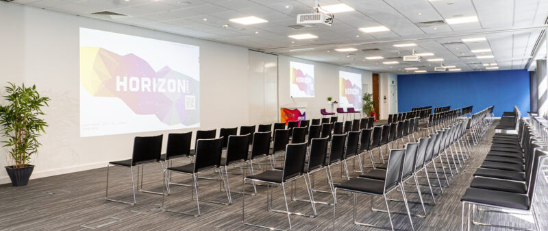

# FOSS4G:UK 2026 Leeds - Horizon Leeds, 12th - 13th October

### FOSS4G:UK is back in Leeds again

OSGeo:UK is pleased to announce that FOSS4G:UK is back in Leeds again this year. The event is organized at the same venue as last year, [Horizon Leeds](https://horizonleeds.co.uk/) on 12th and 13th October, 2026.
More information to be updated soon.

### Registration

Registration informatio will be updated soon

### Sponsors

We are looking for sponsors for this event

### Questions?

Get in touch with one of the organising committee members below, or email us at [osgeouk@gmail.com](mailto:osgeouk@gmail.com).

### Local Organising Team

* [Alastair Graham](https://social.vivaldi.net/@ajggeoger)
* [Ant Scott](https://mastodon.social/@antscott)
* [Nick Bearman](https://www.linkedin.com/in/nickbearman)
* [Claire Birnie](https://www.linkedin.com/in/clairelouisebirnie/)
* [Tom Chadwin](https://mastodon.social/@tomchadwin@en.osm.town)
* [Json Singh](https://www.linkedin.com/in/jsonsingh/)
