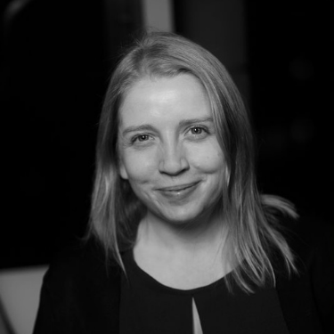
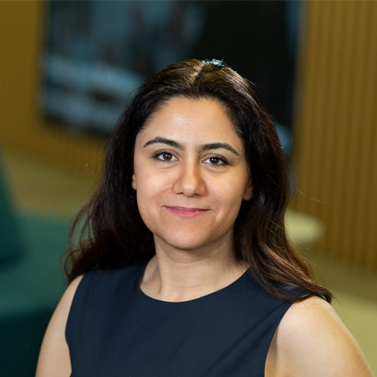

    
    

        <h3 style="margin-bottom:0; padding-bottom:0; display:flex; align-items:center;">Abigail Page
        <a href="https://www.linkedin.com/in/abipage/" target="_blank">

</a></h3>
        <em>Head of UK Geospatial Strategy,</em>
         
        <em>Government Digital Service,</em>
         
        <em>Department for Science, Innovation and Technology</em>
    

 <strong>Abigail Page </strong> is Head of UK Geospatial Strategy in the Government Digital Service, leading work on the UK’s geospatial strategy and long-term capability to support better public sector decision-making and delivery.

She has more than 20 years’ experience across geospatial data, digital and public policy, with a career spanning technical roles, consultancy, European collaboration and senior government leadership. This includes work across central government, EuroGeographics and local public services, giving her a broad perspective on how geospatial capability is developed and used in practice.

Abigail has been part of the geospatial community throughout her career, including serving on the Local Organising Committee for the international FOSS4G 2013 conference in Nottingham. She later chaired the Association for Geographic Information and is currently Deputy Head of the Government Geography Profession. She is a Fellow of the Royal Geographical Society and was recognised as one of the inaugural Geo100. Her work is grounded in collaboration, community and supporting others to thrive in the geospatial field, including mentoring and championing women in geospatial.

 

    
    

        <h3 style="margin-bottom:0; padding-bottom:0; display:flex; align-items:center;">Professor Anahid Basiri
        <a href="https://www.linkedin.com/in/anahid-basiri-3643b3210/" target="_blank">

</a></h3>
        <em>Chair of Geospatial Data Science</em>
         
        <em>Director of Centre for Data Science and AI</em>
         
        <em>UKRI Future Leaders Fellow</em>
         
        <em>RAEng EngineeringX Champion</em>
         
        <em>Editor in Chief of Journal of Navigation</em>
         
        <em>School of Geographical & Earth Sciences</em>
         
        <em>University of Glasgow</em>
    

 <strong>Ana Basiri</strong> is Professor and Chair of Geospatial Data Science at the University of Glasgow, Director of the Centre for Data Science and AI, and a UKRI Future Leaders Fellow.

She leads an interdisciplinary team working on developing theoretical and applied solutions to the challenges posed by new forms of data, particularly missingness, bias, and data quality issues.

Her work is founded on the principle that data missingness can be considered as useful data and to get insights into the underlying causes of exclusion, enabling the development of more inclusive and equitable Geo-AI.

 
