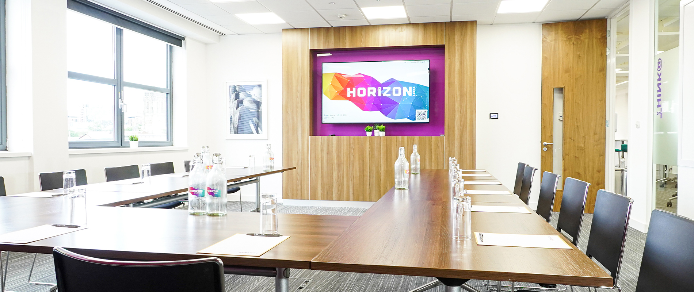

<h1>FOSS4G:UK 2026 Registration</h1>

[Registration for FOSS4G:UK 2026 on 12th and 13th October is open!](https://pretix.eu/osgeo-uk/foss4g-uk-2026/) Full price tickets are now at early bird price of <b>£85</b> (only available till 31st July) - but <b>sales end 1st October</b> - to cover a full programme of over 50 talks and workshops over the two days. We've also added day tickets at £65 each, so if you can't make the full conference, this is for you.

We want FOSS4G:UK 2026 to be as accessible as possible, so we have a number of codes available for two-day tickets discounted to £20. These are available for students, under represented groups, those on a low income, those in precarious employment, and anyone else for whom a full price ticket would be a barrier (financial or administrative). All of these criteria are self-defined. We very much encourage you to email <osgeouk@gmail.com> to ask for a code, stating which group you belong to (no further justification is needed).

<!-- There'll be a optional social event at the [Canal Club](https://www.canalclub.co.uk/) on the evening of 1st October for an addional cost of £20 (to cover venue costs and food), which is an add-on in the registration form. This will be a great chance to socialise with other delegates and catch up on the day's events, so please sign up to enjoy an evening of networking around FOSS4G and anything else!

 -->
