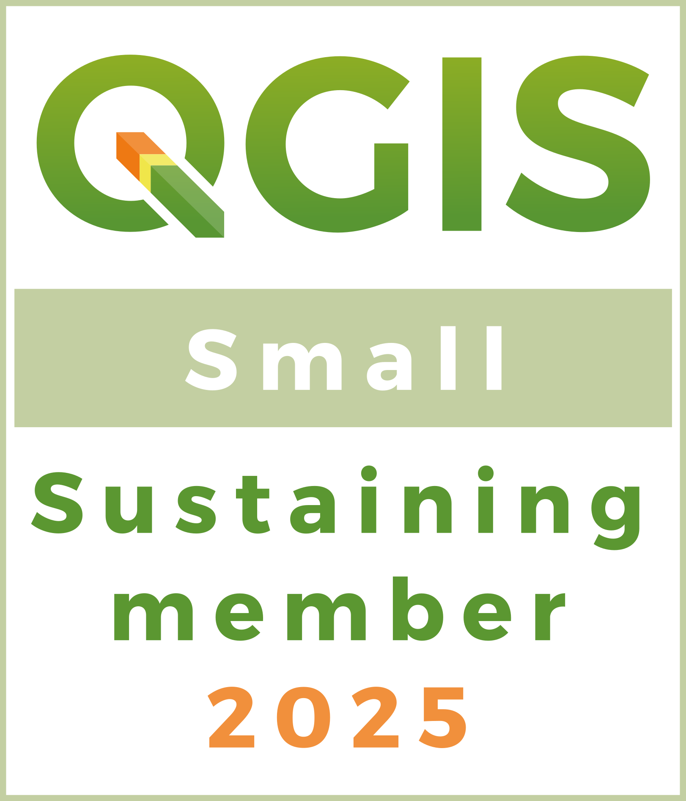

## GoFundGeo 

### Supporting Open Source Geospatial software development in the UK

### 2025

At our meeting on 10th Dec 2025, we agreed to fund a total of £6,496 across 8 projects. 

* [qgis2web](https://github.com/qgis2web/qgis2web): Supporting Andrea Ordonselli to develop gis2web, £1,000
* [GeoNetwork](https://www.geocat.net/blog/news-1/geonetwork-5-crowdfunding-12), £1,000
* [Chiara Gericke, LA tool takeaway outlet exposure schools](https://zenodo.org/records/15230175), £1,000
* [James Milner, development of Terra Draw](https://github.com/JamesLMilner/terra-draw), £1,000
* [Nick Bearman, development of gitRmap](https://github.com/nickbearman/open-science-activism-map), £500
* [pgRouting Gold Sponsorship](https://pgrouting.org/donate.html#sponsors), $1200/£916 per year
* [QGIS Sustaining Membership small level](https://www.qgis.org/en/site/about/sustaining_members.html), €1,000/£880 per year
* [GISRUK & OSGeo:UK GoFundGeo Award](https://2024.gisruk.org//osgeo/) supporting the award for 2026, last year it was awarded to [Utilising Open Data to Enhance Park Safety for Women and Girls in Bradford](#utilising-open-data-to-enhance-park-safety-for-women-and-girls-in-bradford-gisruk--osgeouk-gofundgeo-award-2025) £200
<!-- * As a result of sponsoring [OSGeo Projects](https://www.osgeo.org/about/how-to-become-a-sponsor/) with a total of £3,803, we continue to be a [OSGeo Silver Sponsor](https://www.osgeo.org/sponsors/).  -->

See our latest newsletter for a summary of the projects and our discussions, and see the [Google Doc](https://docs.google.com/document/d/1UUl6NmGmUUowluU8L6dNfF6mUO9kZCOU7W1TvmPQM4I/edit?usp=sharing) for information on the proposals and the [notes tab](https://docs.google.com/document/d/1UUl6NmGmUUowluU8L6dNfF6mUO9kZCOU7W1TvmPQM4I/edit?tab=t.vkm28w38iyr9) for our discussions. 

----

Some testimonials from previous funding recipients:

The funding from OSGeo:UK has been pivotal to the development of Terra Draw. The funding came around the time of Terra Draws inception, and has allowed us to achieve all the goals we set out in the initial proposal and more. Now a year or so later, Terra Draw has gone from 0 external contributors to 6 and has accrued 250+ stars on GitHub. Interest is growing and we are gradually seeing increased usage across the ecosystem. We are grateful to OSGeo:UK for helping enable this.

*James Milner, Terra Draw*

"OSGeo:UK has been behind several of our development efforts and funded many of the works for improving QGIS. It is a very active and vibrant community and we enjoy participating in the annual FOSS4G:UK."

*Saber Razmjooei, Managing Director, Lutra Consulting*

"The generosity of the group in directly funding the software projects is greatly appreciated, and helps maintain the ongoing sustainability of QGIS".

*Nyall Dawson, Director, North Road*

"QGIS is the most popular Desktop Open Source GIS and offers tools not only for traditional GIS users, but also for serving data on the web, collecting data in the field, manipulating (geo)data with automated workflows and as a toolkit for developers. 

Another active (Q)GIS year has passed with many improvements in QGIS itself (desktop, mobile, server, web client and wasm) and its infrastructure. Finally, we released our new and modern QGIS website. Many of these improvements could only be realized or implemented because you supported QGIS in the past. Thank you very much!

With the growing size of the QGIS project and community there are new challenges and growing pains as a result of this success. Sustaining memberships, such as the one provided by OSGeo:UK, ensure that [QGIS.ORG](https://qgis.org/) can finance projects, people and infrastructure in order to overcome these growing pains and meet these challenges. They help us to offer an ever improving QGIS for at least another 20 years to our users. 

Sustaining membership income is used primarily for bug fixing, quality assurance, infrastructure, documentation, system administration, software packaging and the QGIS grant program. The grant program helps to improve QGIS under the hood: code refactoring, polishing of existing tools, infrastructure work, etc. Financial reports of [QGIS.ORG](https://qgis.org/) can be found in the [QGIS finance section](https://www.qgis.org/en/site/getinvolved/governance/finance/index.html)."

*Andreas Neumann, QGIS.org Treasurer*

----

### Utilising Open Data to Enhance Park Safety for Women and Girls in Bradford: GISRUK & OSGeo:UK GoFundGeo Award 2025

[GISRUK and OSGeo:UK](https://2024.gisruk.org/osgeo/) have co-funded a GoFundGeo grant of £500 that has been offered to one GISRUK presenter who presents a tool or technique that has potential for wide uptake in the open source geospatial (OSGeo) community. The purpose of the grant is to help the recipient to make their approach easily adoptable through the provision of open source code repository and/or tool (e.g. a QGIS plugin). 

It gives me great pleasure to announce that the 2025 Award goes to Melissa Barrientos for her work on Utilising Open Data to Enhance Park Safety for Women and Girls in Bradford. 

The project demonstrated how open spatial data and gender-sensitive metrics can translate women lived experiences into actionable insights for safer park design. Since receiving the OSGeo:UK GoFundGeo Award we have received funding for a further phase that will extend the open-source Safer Parks Dashboard from Bradford to West Yorkshire and then scale it nationally, integrating lighting, sightlines, access points, and crime data with innovative spatial syntax measures. All tools, datasets, and a Python package will be released under open licenses to ensure transparency, reproducibility, and long-term sustainability. By advancing open, community-driven geospatial solutions, this work empowers councils, police, and communities to create safer, more inclusive public spaces.

Links for a [YouTube Video](https://www.youtube.com/watch?v=jy-0h3yZ8P4), [Project Information](https://www.leeds.ac.uk/policy-leeds/dir-record/profiles/23347/utilising-open-data-to-enhance-park-safety-for-women-and-girls-in-bradford) and [Project Award](https://environment.leeds.ac.uk/directories0/dir-record/research-projects/2061/utilising-open-data-to-enhance-park-safety-for-women-and-girls-in-bradford) from University of Leeds. 

----

### Flexurba: GISRUK & OSGeo:UK GoFundGeo Award 2024

[GISRUK and OSGeo:UK](https://2024.gisruk.org/osgeo/) have co-funded a GoFundGeo grant of £500 that has been offered to one GISRUK presenter who presents a tool or technique that has potential for wide uptake in the open source geospatial (OSGeo) community. The purpose of the grant is to help the recipient to make their approach easily adoptable through the provision of open source code repository and/or tool (e.g. a QGIS plugin). 

It gives me great pleasure to announce that the 2024 Award goes to Céline Van Migerode for Flexurba: An Open-Source R Package To Flexibly Reconstruct The Degree Of Urbanisation Classification. 

Flexurba, in a library written in R with the first open reconstruction of the Degree of Urbanisation algorithm to classify cities, towns, and rural areas. The package offers enhanced flexibility and facilitates constructing alternative versions of the classification by customising the minimum population size required for a city, and more ‘hidden’ implementation details including contiguity requirements and smoothing rules. The package enables a broad range of analyses beyond the Degree of Urbanisation’s original application, such as evaluating alternative urban delineations, sensitivity analyses and comparative research. 

Flexurba’s source code be [explored here](https://gitlab.kuleuven.be/spatial-networks-lab/research-projects/flexurba), and the documentation is included on [this website](https://flexurba-spatial-networks-lab-research-projects--e74426d1c66ecc.pages.gitlab.kuleuven.be/). Céline's paper at [GISRUK is available here](https://zenodo.org/records/10899270). 

----

### 2024

At our [AGM on 18th November 2024](https://uk.osgeo.org/agm/agm2024minutes.html), we agreed to fund a total of £5,003 across 6 projects. 

* [pgRouting Gold Sponsorship](https://pgrouting.org/donate.html#sponsors), $1200/£963 per year
* [QGIS Sustaining Membership small level](https://www.qgis.org/en/site/about/sustaining_members.html), €1,000/£840 per year
* [qgis2web](https://github.com/qgis2web/qgis2web): Supporting Andrea Ordonselli to develop gis2web, £1,000
* [GeoServer](https://geoserver.org/behind%20the%20scenes/2024/09/10/gs3.html) Supporting GeoServer's crowdfunding campaign
* [James Milner, development of Terra Draw](https://github.com/JamesLMilner/terra-draw), £1,000
* [GISRUK & OSGeo:UK GoFundGeo Award](https://2024.gisruk.org//osgeo/) supporting the award for 2025, last year it was awarded to [Flexurba](#flexurba-gisruk--osgeouk-gofundgeo-award) £200
* As a result of sponsoring [OSGeo Projects](https://www.osgeo.org/about/how-to-become-a-sponsor/) with a total of £3,803, we continue to be a [OSGeo Silver Sponsor](https://www.osgeo.org/sponsors/). 

With thanks to the [RGS-IBG GIScience Research Group](https://geoinfo.science/){:target="_newpage"} who have provided funding of £150 to support the above projects. If your organisation is interested supporting future funding, please email . 

We have around £1000 remaining for allocation at a later date, so if you do have a project that might qualify, please check out [funding guidlines](fundingguidelines.html) rules and let us know, via  or the [email list](https://lists.osgeo.org/mailman/listinfo/uk). 

----

### 2023

At our [AGM on 20th November 2023](https://uk.osgeo.org/agm/agm2023minutes.html), we agreed to fund a total of £5,633 across 7 projects. 

* [pgRouting Gold Sponsorship](https://pgrouting.org/donate.html#sponsors), $1200/£963 per year
* [QGIS Sustaining Membership small level](https://www.qgis.org/en/site/about/sustaining_members.html), €1,000/£870 per year
* [James Milner, development of Terra Draw](https://github.com/JamesLMilner/terra-draw), up to £1,000
* North Road/Nyall Dawson: QGIS layout background formatting, £1,000
* [GISRUK GoFundGeo](https://2024.gisruk.org//osgeo/): - [Flexurba](#flexurba-gisruk--osgeouk-gofundgeo-award) £200
* Dorset Code Sprint: £600
* [qgis2web](https://github.com/tomchadwin/qgis2web): Supporting Andrea Ordonselli to take on and develop gis2web, £1,000
* As a result of sponsoring [OSGeo Projects](https://www.osgeo.org/about/how-to-become-a-sponsor/) with a total of £1,833 / $2,317, we are now an [OSGeo Silver Sponsor](https://www.osgeo.org/sponsors/). 

With thanks to the [RGS-IBG GIScience Research Group](https://geoinfo.science/){:target="_newpage"} who have provided funding of £250 to support the above projects. If your organisation is interested supporting future funding, please email . 

We have around £500-£1000 remaining for allocation at a later date, so if you do have a project that might qualify, please check out [funding guidlines](fundingguidelines.html) rules and let us know, via  or the [email list](https://lists.osgeo.org/mailman/listinfo/uk). 

----

### 2022 

[As agreed at the 2022 AGM](https://uk.osgeo.org/agm/agm2022minutes.html){:target="_newpage"}:

* [Funding for Patreonship of Regina Obe](https://www.patreon.com/reginaobe/overview){:target="_newpage"} : $60 per month inc VAT [£638.52 per year]
* [QGIS Sustaining Membership, small level](https://www.qgis.org/en/site/about/sustaining_members.html){:target="_newpage"} : €500 per year [£440 per year]
* [James Milner, development of Terra Draw](https://github.com/JamesLMilner/terra-draw){:target="_newpage"} : £800
* [Lutra Crowdfunding: Point cloud processing in QGIS](https://www.lutraconsulting.co.uk/crowdfunding/pointcloud-processing-qgis/){:target="_newpage"} : £1,000
* [North Road/Nyall Dawson QGIS HTML formatting in labels](https://github.com/qgis/QGIS/pull/50848){:target="_newpage"} : £1,000
* Potentially about £1,000 remaining for allocation at a later date.

With thanks to the [RGS-IBG GIScience Research Group](https://geoinfo.science/){:target="_newpage"} who have provided funding of £250 to support the above projects. If your organisation is interested supporting future funding, please email . 

Additional donations have been made previously. See [past donations](pastdonations.html) for details of these. 

*Spot a typo or error? Fix on [GitHub](https://github.com/osgeouk/website/blob/gh-pages/gofundgeo.md){:target="_newpage"} ([How?](https://uk.osgeo.org/editing-on-github){:target="_newpage"})*

<!-- Jonny Huck Email Obfuscator -->
<!-- Simply add...    ...wherever you would like the email link to appear -->

