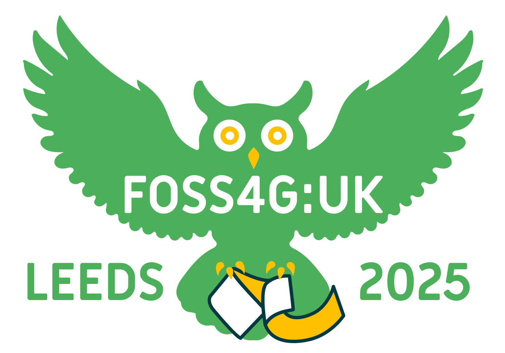

*Our [**OSGeo:UK Members Survey 2026**](https://forms.gle/BkT2jc7x671pXoRh9) is now live! We want to know a bit more about our members, more [details](https://lists.osgeo.org/pipermail/uk/2026-January/001405.html).*

*[**GoFundGeo** has now awarded £6,496 across 8 projects](gofundgeo.html).* 

### OSGeo:UK AGM at FOSS4G:UK 2025 Leeds, 4:15pm Wednesday 1st October 2025

Our AGM was held this year as part of FOSS4G:UK, and the [minutes](https://uk.osgeo.org/agm/agm2025minutes.html) are now available, and the [slides are here](https://docs.google.com/presentation/d/1m0Nz6GT3CBhiUcxnszFMIvG23cuTVb7urZ5lRH2R5YM/edit?usp=sharing). 

### FOSS4G:UK 2025 in Leeds on Wed 1st and Thu 2nd October 2025 is over!

FOSS4G:UK 2025 in Leeds is done and dusted! 180 delegates attended over 50 talks and workshops over the two days, we got [great feedback](https://drive.google.com/file/d/12awtfG16wTJ51ZSk7V3bFC6we8wTS1-x/view?usp=sharing) on the event, and have [some thoughts](https://docs.google.com/document/d/1LPYCZq5SPNPDtmDTq0-xULU23YvuKhSfluDk7a5FhcQ/edit?usp=sharing) on how the event could be even better next time.

Most of the talks were recorded and are available on [YouTube](https://youtube.com/playlist?list=PLCvveKqdciOm-5Mfrppm1-bWmHZeUUwQo&si=s88iaUk4-lnRjrlk).

Huge thanks to all our sponsors (see end of page), speakers, attendees, the staff at [Horizon Leeds](https://horizonleeds.co.uk/), and finally the Local Organising Committee for making this event such a success - we're thinking about possible future events in 2026 and 2027, so keep an eye on this site for more details. 

----

### FOSS4G:UK South West 2024 - a big success!

We had a fantastic [one day FOSS4G:UK SW meetup in Bristol in November 2024](https://uk.osgeo.org/foss4guk2024/bristol.html) at our now customary venue [The Engine Shed](https://engine-shed.co.uk/) at Bristol Temple Meads station. The [programme](https://uk.osgeo.org/foss4guk2024/bristol.html#programme) got to hear presentations on great topics, discussions, and took part in networking. Of course, there was Geodrinks afterwards. 

A complete write up is included in the December newsletter, so make sure you are signed up: [Sign Up Link](https://stats.sender.net/forms/b4160d/view)

----

***GoFundGeo** has funded £5,003 across [6 different projects!](gofundgeo.html) Congratulations to all the award recipients.* 

*[**OSGeo:UK AGM** Mon 18th Nov 2024 1pm, Minutes now online](agm/agm2024minutes.html)*

----

### UK Code Sprint - Code by the Coast

 

On Tue 30th July 2024, we had a great day at Code by the Coast, at The Heights, Portland, Dorset. OSGeo:UK's latest code sprint brought 18 people together to work on a number of FOSS4G projects, including Terra Draw and GIFramework Maps. Along with the great coding and networking, we also had some lovey views in an excellent venue. 

Many thanks to both OSGeo:UK GoFundGeo and Addresscloud for sponsoring the event, and for those participants who paid for their own tickets - we couldn't have done it without you! 

 

Check out the [page](code-sprint-2024.html) for more details, and if you have any questions, please email us . 

----

### OSGeo:UK Newsletter

We now send a newsletter to the open source geo community in the UK and Ireland on a 2-3 monthly cycle. This includes general news from OSGeo and information about events including upcoming FOSS4GUK meetups. The newsletter will not replace the UK mailing list which will continue to be the place for ongoing discussions.
Click [here to see an example of the newsletter](https://campaign-statistics.com/browser_preview/RjAdmmDyQU_N7aJw) or sign up using this dedicated [Sign Up Link](https://stats.sender.net/forms/b4160d/view) 

 
----

### GoFundGeo & AGM 2024

OSGeo:UK AGM took place on 18 Nov 2024 and the [minutes](https://uk.osgeo.org/agm/agm2024minutes.html) are now available.We agreed to fund a total of £5,003 across 6 projects through [GoFundGeo](gofundgeo.html) - see the minutes for full details.

With thanks to the [RGS-IBG GIScience Research Group](https://geoinfo.science/){:target="_newpage"} who have provided funding of £250 to support the above projects. 

See under _Funding_ below for more details. 

----

### Events

Thinking of an Open Source GIS event, and after some support? Contact us on the mailing list below and tell us your idea! See our [past events](pastevents.html){:target="_newpage"} page for details of events we have supported or organised in the past.

[FOSS4G:UK 2025](https://uk.osgeo.org/foss4guk2025/index.html) | [FOSS4G:UK SW 2024](foss4guk2024/index.html) |[FOSS4G:UK Local 2023](foss4guklocal2023/index.html) | [FOSS4G:UK Local 2022](/foss4guk2022local/) | [FOSS4GUK Online 2020](/foss4gukonline2020/) | [FOSS4GUK 2019](/foss4guk2019/)

See also our [guidelines page](foss4gukguidelines.html){:target="_newpage"} for information on setting up a FOSS4GUK event.

### Contact

For updates follow [OSGeo:UK on LinkedIn](https://www.linkedin.com/company/osgeo-uk/posts/?feedView=all){:target="_newpage"}, [@osgeouk on Mastodon](https://fosstodon.org/@osgeouk){:target="_newpage"}, [@osgeouk on Bluesky]([https://twitter.com/osgeouk](https://bsky.app/profile/uk.osgeo.org){:target="_newpage"}, [our mailing list](https://lists.osgeo.org/mailman/listinfo/uk){:target="_newpage"}, or [our Matrix Chat Room](https://matrix.to/#/%23OSGeoUK:matrix.org){:target="_newpage"}.

### Training

See the [training page](training.html) for details of upcoming training courses related to OSGeo projects. 

Training providers - see the instructions at the bottom of that page for how to add your own courses to the list.

### Legal

OSGeo:UK is an unincorporated organisation. Our current constitution, adopted in October 2025 is [here](files/OSGeoUKConstitution-2025_signed_NB_AS_JS.pdf){:target="_newpage"}. Our previous constitution, adopted in March 2016 and altered by SGM in December 2018, can be found [here](/files/OSGeoUKFinalConstitution_2018_amendments-signed.pdf){:target="_newpage"}.

Our previous constitution can be found [here](/files/OSGeo UK Final Constitution - Signed.pdf){:target="_newpage"}.

__Officers__

* Chair: [Nick Bearman](https://www.nickbearman.com/)
* Secretary: [Ant Scott](https://mastodon.social/@antscott)
* Treasurer: [Json Singh](https://jsonsingh.com)

__Committee__

* [Dave Barter](https://twitter.com/NautoGuide)
* [Alastair Graham](https://social.vivaldi.net/@ajggeoger)
* [Tom Armitage](https://www.osgeo.org/member/armitage/)
* [Jonny Huck](http://jonnyhuck.co.uk/)
* [Dennis Bauszus](https://www.linkedin.com/in/dennis-bauszus-45b55760/)
* [James Milner](https://www.linkedin.com/in/jameslmilner/)

### Funding

From time to time we may choose to financially support an open source GIS project, or help someone attend an event. See [funding guidelines](fundingguidelines.html){:target="_newpage"} for more details on how to apply.

[GoFundGeo](gofundgeo.html){:target="_newpage"} annually funds a range of Open Source Geospatial software projects that will have an impact in the UK. Each year we use the surplus from our FOSS4G:UK conferences to fund relevant projects in the range of £500 - £1000 each. We also occasionally make ad-hoc donations to revelant projects, see [past donations](pastdonations.html){:target="_newpage"} for yearly breakdowns on the projects we have supported to date.

### Donate

Help us support and promote the use of open source geospatial software within the UK [by donating via PayPal](donations.html){:target="_newpage"}.

<!-- Jonny Huck Email Obfuscator -->
<!-- Simply add...    ...wherever you would like the email link to appear -->

